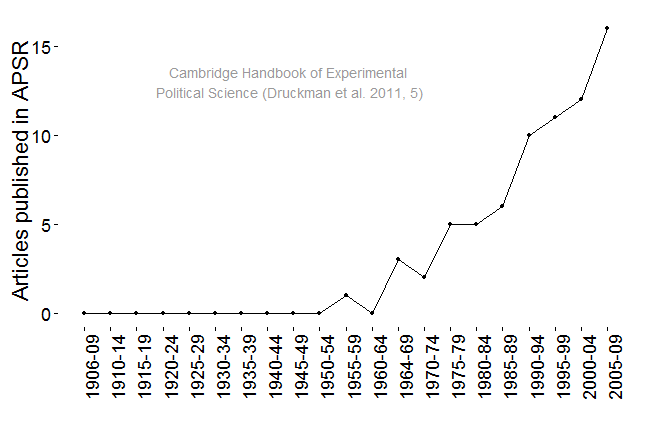
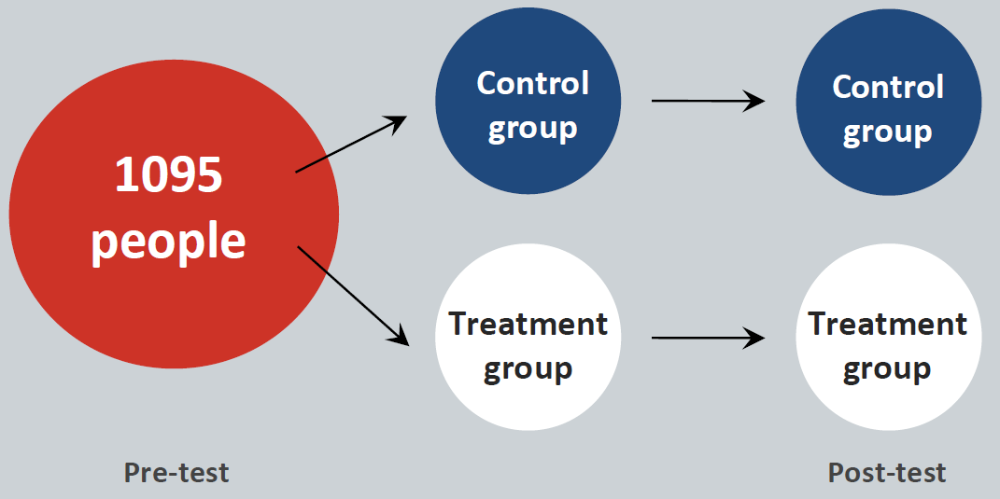
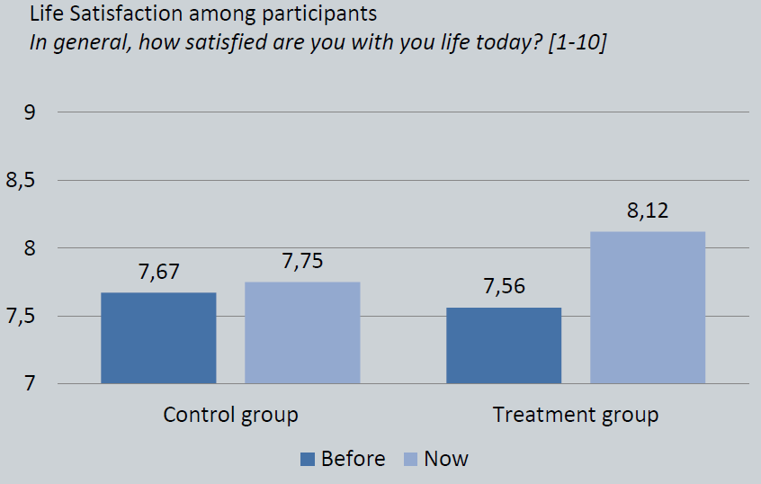
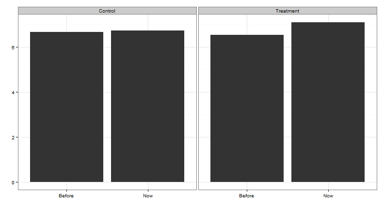

### Experiments and Causal Inference

#### Advanced applied statistics, 2015

##### Erik Gahner Larsen

---

### Experiments in political science research

 

---

"Like it or not, social scientists rely on the logic of experimentation even when analyzing nonexperimental data." (Green and Gerber [2003](http://ann.sagepub.com/content/589/1/94.abstract), 110)

"In some sense every empirical researcher is reporting the results of an experiment. Every researcher who behaves as if an exogenous variable varies independently of an error term effectively views their data as coming from an experiment." (Harrison and List [2004](http://www.jstor.org/stable/3594915), 1009)

---

"[T]here is no reason to suppose that case study research follows a divergent logic of inquiry relative to experimental research." (Gerring and McDermott [2007](http://onlinelibrary.wiley.com/doi/10.1111/j.1540-5907.2007.00275.x/abstract), 689)

"If you can't devise an experiment that answers your question in a world where anything goes, then the odds of generating useful results with a modest budget and nonexperimental survey data seem pretty slim. The description of an ideal experiment also helps you formulate causal questions precisely." (Angrist and Pischke [2009](http://press.princeton.edu/titles/8769.html), 5)

---

## Agenda

- Causal effects

- Experiments and assumptions

- Issues in experimental research

- Types of experiments

---

### Example: The effect of facebook use on life satisfaction

- How would we test this in an observational setting? 

- What is the problem?

---

### What is it all about?

- We need strong designs in order to make causal inferences
    - Remember: Science is all about causality

- The issue it not the data we have ... but the data we do __not__ have.

- "Easy" to measure the factual world
    - What about the counterfactual world?

- We need theoretical and statistical tools to make valid counterfactuals

---

- From estimation strategies (_statistics_) to identification strategies (_design_):
    + "Without an experiment, a natural experiment, a discontinuity, or some other strong design, no amount of econometric or statistical modeling can make the move from correlation to causation persuasive." (Sekhon [2009](http://www.annualreviews.org/doi/abs/10.1146/annurev.polisci.11.060606.135444), 503)

---

### Neyman-Rubin causal model

- We are interested in potential outcomes to define causal effects

- For individual _i_, we have a potential outcome: $Y_{i}$

- Treatment: $W_{i}$

- Potential outcome given treatment treatment status: $Y_{i}(W_{i})$

- Two potential outcomes: $Y_{i}(1), Y_{i}(0)$

- Unit causal effect: The difference between a unit's potential outcome under treatment and the unit's potential outcome under control.

$\tau_{i} = Y_{i}(1) - Y_{i}(0)$

---

#### Example: facebook and life satisfaction

| User _i_    | $Y_{i}(0)$ (no facebook) |
|-------------|:---:|
| 1           | 60 | 
| 2           | 20 | 
| 3           | 80 | 
| 4           | 30 | 
| 5           | 40 | 
| 6           | 75 | 
| 7           | 40 | 
| 8           | 20 | 
| 9           | 60 | 
| 10          | 75 |
| **Average** &nbsp;&nbsp;&nbsp; | **50**  |

---

#### Example: facebook and life satisfaction

| User _i_    | $Y_{i}(0)$ (no facebook) &nbsp;&nbsp;&nbsp; | $Y_{i}(1)$ (facebook)  |
|-------------|:---:|:---:|
| 1           | 60 | 70 | 
| 2           | 20 | 50  |
| 3           | 80 | 80 |
| 4           | 30 | 45 |
| 5           | 40 | 50 |
| 6           | 75 | 60 |
| 7           | 40 | 45  |
| 8           | 20 | 30    |
| 9           | 60 | 85    |
| 10          | 75      | 85    |
| **Average** &nbsp;&nbsp;&nbsp; | **50**  | **60**  |

---

#### Example: facebook and life satisfaction

| User _i_  | $Y_{i}(0)$ (no facebook) &nbsp;&nbsp;&nbsp;   | $Y_{i}(1)$ (facebook) &nbsp;&nbsp;&nbsp; | $\tau_{i}$ |
|-------------|:---:|:---:|:---:|
| 1           | 60 | 70 | 10 |
| 2           | 20 | 50  | 30 |
| 3           | 80 | 80 | 0 |
| 4           | 30 | 45 | 15 |
| 5           | 40 | 50 | 10 |
| 6           | 75 | 60 | -15 |
| 7           | 40 | 45  | 5    |
| 8           | 20 | 30    | 10    |
| 9           | 60 | 85    | 25    |
| 10          | 75      | 85    | 10    |
| **Average** &nbsp;&nbsp;&nbsp; | **50**  | **60**  | **10**  |

---

# FPCI

---

### The Fundamental Problem of Causal Inference (FPCI)

---

### The Fundamental Problem of Causal Inference (FPCI)

- "It is impossible to _observe_ the value of $Y_{i}(1)$ and $Y_{i}(0)$ on the same unit and, therefore, it is impossible to _observe_ the effect of $W_{i}$ on $i$." (Holland [1986](http://www.jstor.org/stable/2289064), 947)

- We observe _one_ outcome: the realised outcome

$R_{i} = W_{i}Y_{i}(1) + (1-W_{i})Y_{i}(0)$

---

#### Example: facebook and life satisfaction

| User _i_  | $Y_{i}(0)$ &nbsp;&nbsp;&nbsp;   | $Y_{i}(1)$ &nbsp;&nbsp;&nbsp; | $W_{i}$ |
|-------------|:---:|:---:|:---:|
| 1           | 60 | ? | 0 |
| 2           | ? | 50  | 1 |
| 3           | 80 | ? | 0 |
| 4           | ? | 45 | 1 |
| 5           | 40 | ? | 0 |
| 6           | ? | 60 | 1 |
| 7           | ? | 45  |  1   |
| 8           | 20 | ?    |  0   |
| 9           | ? | 85    |  1   |
| 10          | 75 | ?    | 0  |

---

#### Example: facebook and life satisfaction

| User _i_  | $Y_{i}(0)$ &nbsp;&nbsp;&nbsp;   | $Y_{i}(1)$ &nbsp;&nbsp;&nbsp; | $W_{i}$ &nbsp;&nbsp;&nbsp; | $R_{i}$ (observed outcome)
|-------------|:---:|:---:|:---:|:---:|
| 1           | 60 | ? | 0 | 60 |
| 2           | ? | 50  | 1 | 50 |
| 3           | 80 | ? | 0 | 80 |
| 4           | ? | 45 | 1 | 45 |
| 5           | 40 | ? | 0 | 40  |
| 6           | ? | 60 | 1 | 60  |
| 7           | ? | 45  |  1   | 45  |
| 8           | 20 | ?    |  0   | 20 |
| 9           | ? | 85    |  1   | 85  |
| 10          | 75 | ?    | 0  | 75  |

---

### So, you cannot prove causality with statistics? 

---

### Well, you can only prove causality _with_ statistics. 

(Rosenbaum [2010](http://www.springer.com/us/book/9781441912121), 35)

---

The FPCI is a missing data problem. What is the solution?

---

## Random assignment


---

### Random assignment

- Create two groups of observations that are, in expectation, identical prior to application of the treatment (Green and Gerber [2012](http://books.wwnorton.com/books/webad.aspx?id=24003), 31)

- Create a counterfactual group.

- Guarantees that the treatment is prior to the outcome, avoiding posttreatment and simultaneity biases.

- $P(W)$ = 0.5 (_coin flip_)

---

### Assumption I: Ignorability of Treatment Assignment

- Pretreatment covariates, $X$

- Unconfoundedness $(Y(1),Y(0),X) \perp W$

- What about $(Y(1),Y(0)) \perp W|X$?
    - We will address this issue next week

---

### Average treatment effect

- What most scholars are interested in

- Average treatment effect: $\tau_{ATE} = E[Y(1) - Y(0)] = E[Y(1)] - E[Y(0)]$

---

### Assumption II: Stable Unit Treatment Value Assumption (SUTVA)

- A collection of implied assumptions about the effect of treatments on individuals

- "The potential outcomes for any unit do not vary with the treatments assigned to other units, and, for each unit, there are no different forms or versions of each treatment level, which lead to different potential outcomes." (Imbens and Rubin [2015](http://www.cambridge.org/it/academic/subjects/statistics-probability/statistical-theory-and-methods/causal-inference-statistics-social-and-biomedical-sciences-introduction), 10)

---

### Assumption II: Stable Unit Treatment Value Assumption (SUTVA)

1. Noninterference: Potential outcomes for unit _i_ depend only on the treatment assignment of unit _i_ (no interference or spillover effect):
  
$(Y(1),Y(0)) \perp W_{j}, \forall i \neq j$

2. Exclusion restriction: Only one version of each treatment possible for each unit

---

### Assumption II: Stable Unit Treatment Value Assumption (SUTVA)

Two implications (from Heckman [2005](http://onlinelibrary.wiley.com/doi/10.1111/j.0081-1750.2006.00164.x/abstract), 11):

- Rules out social interactions and general equilibrium effects.

- Rules out any effect of the assignment mechanism on potential outcomes.

---

### Assumption III: Compliance

- $W_{i}$ is _assignment_ to treatment

- Subjects can - in many cases - decide not to comply

- $D_{i}$: treatment status (1 if treated, 0 if not)

---

### Assumption III: Compliance, always-takers

- Always-takers will _always_ be treated 

- $W_{i}$ = 1, $D_{i}$ = 1

- $W_{i}$ = 0, $D_{i}$ = 1

- Facebook example: Will use facebook independent of treatment assignment

---

### Assumption III: Compliance, never-takers

- Never-takers will _never_ be treated 

- $W_{i}$ = 1, $D_{i}$ = 0

- $W_{i}$ = 0, $D_{i}$ = 0

- Facebook example: Will not use facebook independent of treatment assignment

---

### Assumption III: Compliance, cooperators

- Cooperators will... cooperate

- $W_{i}$ = 1, $D_{i}$ = 1

- $W_{i}$ = 0, $D_{i}$ = 0

- Facebook example: Will _only_ use facebook if assigned to treatment

---

### Assumption III: Compliance, defiers

- Defiers will... do the opposite

- $W_{i}$ = 1, $D_{i}$ = 0

- $W_{i}$ = 0, $D_{i}$ = 1

- Facebook example: Will use facebook if not assigned to treatment and not use facebook if assigned to treatment

- We assume that there are no defiers (monotonicity)

---

### So, which cases inform causal inference?

---

### The cases whose treatment status can be changed (hint: cooperators)

---

#### Assumption III: Compliance

How do we know that $W_{i}$ = 1, $D_{i}$ = 1 is a cooperator and not an always-taker? 

How do we know that $W_{i}$ = 0, $D_{i}$ = 0 is a cooperator and not a never-taker? 

---

#### Assumption III: Compliance

- We only have realised outcomes (we need a counterfactual)

- Hard to say whether we are dealing with compliance or noncompliance

- Remember: Try to measure compliance!

---

### Intention-to-treat

- Our effects are often intention-to-treat (ITT) estimates.

- Mean difference on Y between subjects assigned to treatment and subjects not assigned to treatment.

---

#### Example: Noncompliance with Encouragement $W_{i}$ to Exercise $D_{i}$

- From Table 5.5 in Rosenbaum ([2002](http://www.springer.com/us/book/9780387989679), 182).

- Y = forced expiratory volume (higher numbers signifying better lung function)

- Will subject exercice with encouragement? ($d_{i}(1)$)
- Will subject exercice without encouragement? ($d_{i}(0)$)


---

#### Example: Noncompliance with Encouragement $W_{i}$ to Exercise $D_{i}$

| User _i_ &nbsp;&nbsp;&nbsp; | $d_{i}(1)$ &nbsp;&nbsp;&nbsp; | $d_{i}(0)$ &nbsp;&nbsp;&nbsp; |
|-------------|:---:|:---:|
| 1 | 1 | 1 | 
| 2 | 1 | 1 | 
| 3 | 1 | 0 | 
| 4 | 1 | 0 | 
| 5 | 1 | 0 | 
| 6 | 1 | 0 | 
| 7 | 1 | 0 | 
| 8 | 1 | 0 | 
| 9 | 0 | 0 | 
| 10 | 0 | 0 |

---

What are the potential outcomes?

---

#### Example: Noncompliance with Encouragement $W_{i}$ to Exercise $D_{i}$

| User _i_ &nbsp;&nbsp;&nbsp; | $d_{i}(1)$ &nbsp;&nbsp;&nbsp; | $d_{i}(0)$ &nbsp;&nbsp;&nbsp; | $Y_{i}(1)$ &nbsp;&nbsp;&nbsp; | $Y_{i}(0)$ &nbsp;&nbsp;&nbsp; |
|-------------|:---:|:---:|:---:|:---:|:---:|
| 1 | 1 | 1 | 71  | 71 |
| 2 | 1 | 1 | 68  | 68 |
| 3 | 1 | 0 | 64  | 59 |
| 4 | 1 | 0 | 62  | 57 |
| 5 | 1 | 0 | 59  | 54 |
| 6 | 1 | 0 | 58  | 53 |
| 7 | 1 | 0 | 56  | 51 |
| 8 | 1 | 0 | 56  | 51 |
| 9 | 0 | 0 | 42  | 42 |
| 10 | 0 | 0 | 39 | 39 |


---

Let's assign some treatments and see the realised outcomes.

---

#### Example: Noncompliance with Encouragement $W_{i}$ to Exercise $D_{i}$

| User _i_ &nbsp;&nbsp;&nbsp; | $d_{i}(1)$ &nbsp;&nbsp;&nbsp; | $d_{i}(0)$ &nbsp;&nbsp;&nbsp; | $Y_{i}(1)$ &nbsp;&nbsp;&nbsp; | $Y_{i}(0)$ &nbsp;&nbsp;&nbsp; | $W_{i}$ &nbsp;&nbsp;&nbsp; | $D_{i}$ &nbsp;&nbsp;&nbsp; |  $R_{i}$ |
|-------------|:---:|:---:|:---:|:---:|:---:|:---:|:---:|
| 1 | 1 | 1 | 71  | 71 | 1 | 1 | 71 |
| 2 | 1 | 1 | 68  | 68 | 0 | 1 | 68 |
| 3 | 1 | 0 | 64  | 59 | 1 | 1 | 64 |
| 4 | 1 | 0 | 62  | 57 | 0 | 0 | 57 |
| 5 | 1 | 0 | 59  | 54 | 0 | 0 | 54 |
| 6 | 1 | 0 | 57  | 52 | 1 | 1 | 57 |
| 7 | 1 | 0 | 56  | 51 | 1 | 1 | 56 |
| 8 | 1 | 0 | 56  | 51 | 0| 0 | 51 |
| 9 | 0 | 0 | 42  | 42 | 0 | 0 | 42 |
| 10 | 0 | 0 | 39 | 39 | 1 | 0 | 39 |


---

## Let's create a data frame


```r
di1 <- c(1, 1, 1, 1, 1, 1, 1, 1, 0, 0)
di0 <- c(1, 1, 0, 0, 0, 0 ,0, 0, 0, 0)
Yi1 <- c(71, 68, 64, 62, 59, 57, 56, 56, 42, 39)
Yi0 <- c(71, 68, 59, 57, 54, 52, 51, 51, 42, 39)
Wi <- c(1, 0, 1, 0, 0, 1, 1, 0, 0, 1)
Di <- c(1, 1, 1, 0, 0, 1, 1, 0, 0, 0)
Ri <- c(71, 68, 64, 57, 54, 57, 56, 51, 42, 39)
lung <- data.frame(di1, di0, Yi1, Yi0, Wi, Di, Ri)
```

---

What is the (average) causal effect?

---


```r
mean(
  lung[lung$Wi == 1 & lung$di1 - lung$di0 == 1,]$Ri - 
  lung[lung$Wi == 0 & lung$di1 - lung$di0 == 1,]$Ri
  )
```

```
## [1] 5
```

---

### What is the naive average treatment effect?

---


```r
mean(lung[lung$Di == 1,]$Ri - lung[lung$Di == 0,]$Ri)
```

```
## [1] 14.6
```

```r
summary(lm(Ri~Di, data=lung))
```

```
## 
## Call:
## lm(formula = Ri ~ Di, data = lung)
## 
## Residuals:
##    Min     1Q Median     3Q    Max 
##  -9.60  -6.50   1.60   5.25   8.40 
## 
## Coefficients:
##             Estimate Std. Error t value Pr(>|t|)    
## (Intercept)   48.600      3.225  15.070 3.72e-07 ***
## Di            14.600      4.561   3.201   0.0126 *  
## ---
## Signif. codes:  0 '***' 0.001 '**' 0.01 '*' 0.05 '.' 0.1 ' ' 1
## 
## Residual standard error: 7.211 on 8 degrees of freedom
## Multiple R-squared:  0.5616,	Adjusted R-squared:  0.5068 
## F-statistic: 10.25 on 1 and 8 DF,  p-value: 0.01259
```

---

### Problem

ATE is confounded by endogenous selection into treatment

---

### What is the ITT?

---


```r
mean(lung[lung$Wi == 1,]$Ri - lung[lung$Wi == 0,]$Ri)
```

```
## [1] 3
```

```r
summary(lm(Ri~Wi, data=lung))
```

```
## 
## Call:
## lm(formula = Ri ~ Wi, data = lung)
## 
## Residuals:
##    Min     1Q Median     3Q    Max 
##  -18.4   -2.9   -0.4    5.6   13.6 
## 
## Coefficients:
##             Estimate Std. Error t value Pr(>|t|)    
## (Intercept)   54.400      4.812  11.304 3.38e-06 ***
## Wi             3.000      6.806   0.441    0.671    
## ---
## Signif. codes:  0 '***' 0.001 '**' 0.01 '*' 0.05 '.' 0.1 ' ' 1
## 
## Residual standard error: 10.76 on 8 degrees of freedom
## Multiple R-squared:  0.02371,	Adjusted R-squared:  -0.09832 
## F-statistic: 0.1943 on 1 and 8 DF,  p-value: 0.671
```


---

You might say: "Seriously, I can think of a billion cases where all this might be problematic."

---

### _Welcome to the social sciences_.

---

## Types of experiments

- Lab experiments
- Survey experiments
- Field experiments
- Natural experiments
- Quasi-experiments

---

### Types of designs 

(from Blom-Hansen and Serritzlew [2014](http://politica.dk/fileadmin/politica/Dokumenter/politica_46_1/blom-hansen_og_serritzlew.pdf), 13)

| Experiment    | Comparison of experiment  and control group | Exogenous or as-if  exogenous intervention | Groupings are randomized  or as-if randomized | Researcher manipulates  intervention |
|---------------|---------------------------------------------|--------------------------------------------|-----------------------------------------------|--------------------------------------|
| Lab           | Yes                                         | Yes                                        | Yes                                           | Yes                                  |
| Field         | Yes                                         | Yes                                        | Yes                                           | Yes                                  |
| Survey        | Yes                                         | Yes                                        | Yes                                           | Yes                                  |
| Natural       | Yes                                         | Yes                                        | Yes                                           | No                                   |
| Quasi         | Yes                                         | Yes                                        | No                                            | No                                   |
| Observational | Yes                                         | No                                         | No                                            | No                                   |

---

What type of experiment is the facebook and life satisfaction study? 

---

### Facebook and life satisfaction

- Lab: Get subjects into the lab, randomize, treatment group use facebook.

- Survey: Get subjects to answer a survey, randomize, treatment group see material from facebook.

- Field: Get subjects to sign up, randomize, treatment group use facebook.

- Natural/quasi: Utilize (as-if) random variation in the access to facebook.

- Observational: Ask people about facebook use and life satisfaction :-(

---

### Example: Study design, facebook and life satisfaction



---

### Example: Study effects, facebook and life satisfaction



---

### Example: Study effects, facebook and life satisfaction (0-9)

 

---

#### What if the randomization failed? 


---

## What about covariates?

- Always report the _unadjusted_ treatment effect: "If an estimated treatment effect is insignificant in the absence of controls, this should clearly shape our interpretation of the effect being estimated" (Dunning [2012](http://www.cambridge.org/us/academic/subjects/politics-international-relations/research-methods-politics/natural-experiments-social-sciences-design-based-approach), 268)

- We use experiments so we don't have to care about covariates: "Yet, the whole point of a natural experiment is that such concerns about confounding should be limited by the research design." (Dunning [2012](http://www.cambridge.org/us/academic/subjects/politics-international-relations/research-methods-politics/natural-experiments-social-sciences-design-based-approach), 118)

- Covariates reduce noise, increases the chance that we reach statistical significance (Mutz [2011](http://press.princeton.edu/titles/9620.html), 123f)

- Positive view: Variables measured before the variables of interest was determined are generally good controls (Angrist and Pischke [2009](http://press.princeton.edu/titles/8769.html), 64ff)
    
---

## How to conduct an experiment

- Remember theory.

- Consider -- from a practical perspective -- whether an experiment is feasible

- Specify hypothesis/hypotheses _prior_ to the data collection
    - Prespecification (if you plan to publish in academic journals: preregister)
    - [What is your dependent variable?](https://xkcd.com/882/)

---

## How to report an experiment

- We have specific guidelines for reporting experimental research in political science

- See Gerber et al. ([2014](http://journals.cambridge.org/action/displayAbstract?fromPage=online&aid=9322216&fileId=S2052263014000116)): Reporting Guidelines for Experimental Research: A Report from the Experimental Research Section Standards Committee. _Journal of Experimental Political Science_ 1(1): 81-98.

---

## What about external validity?

- External validity is all about your theory

- And remember: "It makes no sense to say that some empirical research is low on internal validity but high on external validity." (Morton and Williams [2010](http://www.cambridge.org/us/academic/subjects/politics-international-relations/research-methods-politics/experimental-political-science-and-study-causality-nature-lab), 275)

---

### Replication, reproduction and transparency 

- One of the biggest issues with experiments (and all research) today: lack of replications

- Novelty bias (especially in political science!)

- We need more replications of existing experiments

- Sadly, only few examples of direct replications in political science

- "Indeed, few experimental literatures have generated repicable interactions between two variables." (Green and Gerber [2012](http://books.wwnorton.com/books/webad.aspx?id=24003), 310)

---

### Replication, reproduction and transparency 

- Make sure that your research is reproducible (STATA do-file and/or R scripts)

- Share your data

- Reproduce and replicate existing studies (great way to "learn science")

- Be transparent (what did you do, how did you do it etc.)

---

## Observational research

- Cochran's Basic Advice: "The planner of an observational study should always ask himself the question, 'How would the study be conducted if it were possible to do it by controlled experimentation?'" (from Rosenbaum [2010](http://www.springer.com/us/book/9781441912121), 16)

---

### Conclusion: Words to live by

- Think of experiments as observational studies
- Think of observational studies as experiments

---

## Install R and RStudio

R: [cran.rstudio.com](https://cran.rstudio.com/)

RStudio: [rstudio.com/products/rstudio/download/](https://www.rstudio.com/products/rstudio/download/)

---

## Schedule

- Today: Experiments

- Next: Matching
    
- Lecture 13 and 14: Natural experiments
    - Regression-Discontinuity Designs
    - Instrumental Variable Regression
    
- Lab session 6 and 7: R and matching
