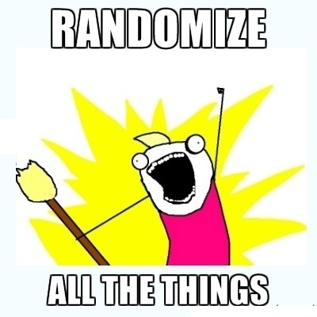
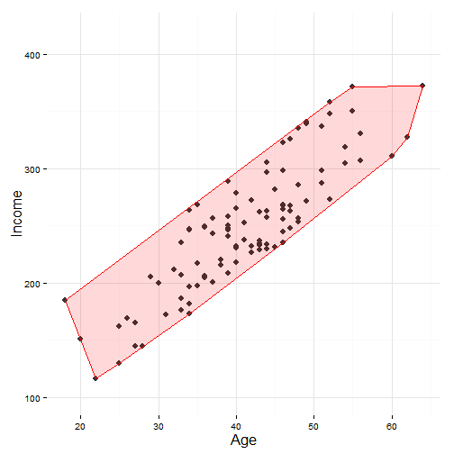
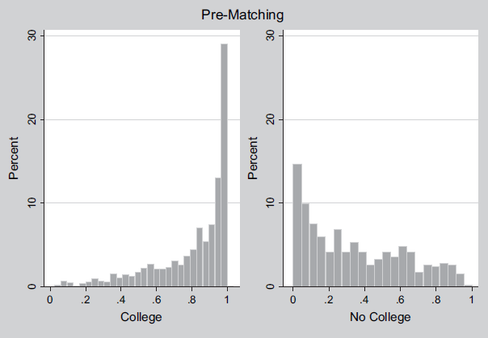
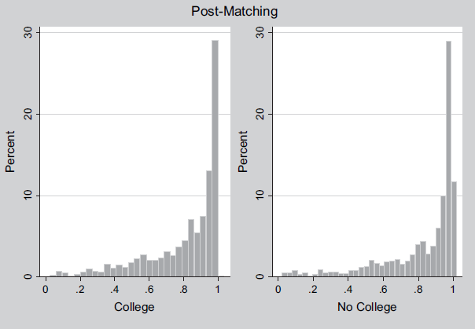
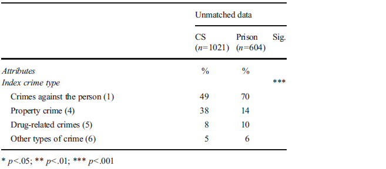
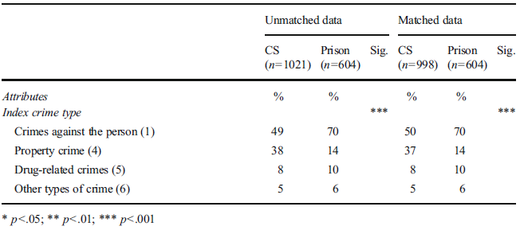
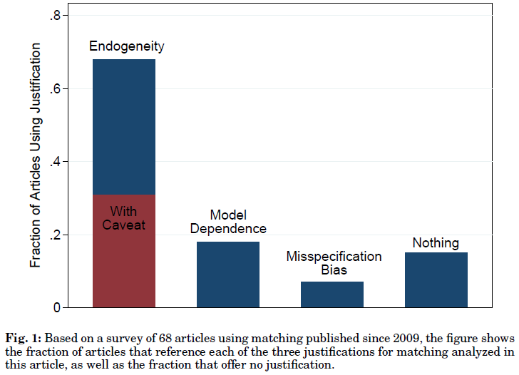

### Matching and Propensity Scores

#### Advanced applied statistics, 2015

##### Erik Gahner Larsen

---

### Feedback: Hierarchical models

- Substantially different assignments 
  - See individual feedback
  
- Make sure that you actually have multiple levels!

- Use `xtreg` or `mixed` 

---

### Last week

- Neyman-Rubin causal model

- FPCI

- Random treatment assignment

- SUTVA, ATE, ITT, (non)compliance

---

### Today: What and how

- What? Reduce bias caused by nonrandom treatment assignment.

- How? Preprocess data _prior_ to running an estimator.

---

### Agenda

- Estimate causal effect of treatment assignment

- Causal inference in observational research

- Matching

- Course evaluation

---

# Matching

---

### Before we get too optimistic

- "Matching has no advantage relative to regression for inferring causation or dealing with endogeneity" (Miller [2015](https://sites.google.com/site/mkmtwo/Miller-Matching.pdf?attredirects=0), 2)

- We still need research designs with strong identification 
  - No identification == shit

- Remember: "Without an experiment, a natural experiment, a discontinuity, or some other strong design, no amount of econometric or statistical modeling can make the move from correlation to causation persuasive." (Sekhon [2009](http://www.annualreviews.org/doi/abs/10.1146/annurev.polisci.11.060606.135444), 503)

---

### Experiments and observational research

"A study without a treatment is neither an experiment nor an observational study." (Rosenbaum [2002](http://www.springer.com/us/book/9780387989679), 1)

---

## What do we really want to do with our treatment?

---

---

### Experiments and causal inference

- We have two _comparable_ groups: Treatment and control

- Covariates are independent of treatment assignment

- The propensity to be assigned to treatment is known (randomization, remember?)

- $P(W_{i})$ = 0.5, for all $i$

- Unconfoundedness $(Y(1),Y(0),X) \perp W$

---

### Causal inference and observational research

- From experiments to observational research designs
    - Make observational studies build on the logic of randomized studies

- In randomized trials, ATE is of crucial interest

- In many observational studies, we are interested in ATT (average treatment effect on the treated):

$ATT = E[Y(1) - Y(0) | W = 1]$

- Why? To evaluate the effect on units for whom the treatment is intended.

- Counterfactual mean: $E[Y(0) | W = 1]$
  - Not observed. Why not use $E[Y(0) | W = 0]$?

---

### Causal inference and observational research

- In observational studies the assignment probability is typically unknown

- Nonrandom treatment assignment

- When covariates, $X$, matter for the treatment assignment: Matching 
  - "Matching refers to a variety of procedures that restrict and reorganize the original sample in preparation for a statistical analysis." (Gelman and Hill [2007](http://www.cambridge.org/us/academic/subjects/statistics-probability/statistical-theory-and-methods/data-analysis-using-regression-and-multilevelhierarchical-models), 206)

---

### Matching: What we want

- We want to maximize balance. Why?

- Use matching to balance covariate distributions

- Make the treated and control units look similar _prior_ to treatment assignment

- Matching only adjust for _observed_ covariates. A solution to OVB?

---

### Matching units

- Matching follows a most similar design logic. We want to compare comparable cases.

- If you are the treated unit, we want control units similar to you.
    - Only difference should be treatment assignment.

- We need a distance metrics ($D_{ij}$) to measure the distance between two units in terms of $X$.
  - We want less distance (_ceteris paribus_)

- Decision to make (and we have to make several decisions): Distance metric.

---

### Exact matching (stratified matching)

- Most straightforward and nonparametric way: match _exactly_ on the covariate values.

$D_{ij} = \begin{cases} 0  & if X_{i} = X_{j} \\ \infty & if X_{i} \not = X_{j} \end{cases}$

- No distance between matches. Infinite distance between observations without matches. 

- Issue: Curse of dimensionality (Sekhon [2009](http://www.annualreviews.org/doi/abs/10.1146/annurev.polisci.11.060606.135444), 497)

- Requirements:
  - Discrete covariates
  - Limited number of covariates

---

### Common distance approaches

- There are multiple different approaches to measure distances

- We focus on two (Sekhon [2009](http://www.annualreviews.org/doi/abs/10.1146/annurev.polisci.11.060606.135444)):
  - Multivariate matching based on Mahalanobis distance
  - Propensity score matching

---

### Mahalanobis distance

- Find control units in a multidimensional space

- CrossValidated: [Explanation of the Mahalanobis distance](http://stats.stackexchange.com/a/62147)

- Considers the distribution and covariance of the data

$D_{ij} = \sqrt{(X_{i} - X_{j})'S^{-1} (X_{i} - X_{j})}$
 
- For ATT, we use the sample covariance matrix ($S$) of the treated data

---

### Propensity score

- Propensity score: "the propensity towards exposure to treatment 1 given the observed covariates x" (Rosenbaum and Rubin [1983](http://biomet.oxfordjournals.org/content/70/1/41), 43)

- Propensity score (assignment probability): $p_{i} \equiv Pr(W_{i} | X_{i})$

- Probability of receiving treatment given the vector of covariates

- Distance: $D_{ij} = | p_{i} - p_{j} |$

---

### Regular design features

- Assumption 1: $Pr[W | X, Y(1), Y(0)] = Pr(W | X)$ (Unconfoundedness)

- Different people have different propensity scores (Rubin [2004](http://jeb.sagepub.com/content/29/3/343.abstract)). Examples: 
  - older males have probability 0.8 of being assigned the new treatment
  - younger males 0.6
  - older females 0.5
  - younger females 0.2

---

### Regular design features

- Assumption 2: $0 < p_{i} < 1$ (Strictly between 0 and 1, i.e. overlap)

- Ignorability (Assumption 1). Strong Ignorability (Assumption 1 + 2) (Rosenbaum and Rubin [1983](http://biomet.oxfordjournals.org/content/70/1/41))

---

### Propensity score in practise

- A propensity score for each unit (i.e., an extra column in our data set)

- The propensity score can be the predicted probability from a logistic regresion

---

### Overlap: Treatment effects on different people

- Matching: We want to have similar people for whom we can make inferences

- People should be as identical as possible with the exception of treatment assignment

- Consider two covariates: Age and income

---

### Treatment effects on different people

 

---

### Treatment effects on different people

 

---

### Treatment effects on different people

 

---

### What is a reasonable match?

- There are units with no counterfactual(s) in the control group.

- How close should two units be?

- It can make sense to drop units with bad matches. How? 
  - Set a caliper and drop matches where distance is greater than the caliper
  - Implication: Parameter of interest is the treatment effect for treated units with reasonable controls.

- So we kick out observations? Yep, ignore or downplay bad people. We want good people.

---

### Overlap

- Overlap (common support)

- What if $p_{i} = 1$ or $p_{i} = 0$?

- Deterministic treatment assignment: not possible to estimate treatment effect

- Exclude cases with $p_{i}$ close to 0 or 1 (rule of thumb:$p_{i} < 0.1$ and $p_{i} > 0.9$) 

---

### What about lack of overlap in OLS?

- How does OLS react to a lack of overlap? 

---

# OLS is a beast

---

### What about ties?

- There may be cases where multiple controls have the same distance to the treated unit

- Two possibilities:
  1. Coin flip (randomize)
  2. Weight (match all control units with the shortest distance)

---

### Pre-treatment covariates

- Choose a set of covariates that you want to match on

- Important: 
  - Pre-treatment
  - Satisfy ignorability

---

### Matching methods: How to match units

- Nearest neighbor matching (with or without caliper)
      
- Radius matching
      
- Genetic matching

- Coarsened exact matching

---

### Nearest neighbor

- The nearest neighbor. Choose the closest control unit to each treated uit.

- Trade-off: Bias and variance

- Number of matches
  - Matching one NN: Less bias, more variance
  - Mathing 1:n NN: Less variance, more bias

- Replacement
  - With replacement: Low bias, more variance
  - Without replacement: Low variance, potential bias

---

### Replacement or not

- Should we match with replacement or without replacement?

- Match with replacement: Every treated unit can be matched to the same control unit
  - Reduce bias but might increase variance of estimator if only few control units are matched
  
- Match without replacement: Each control unit can be matched one time (at most)

- Rule of thumb: Match with replacement
  - Why? To make sure we get the best match

---

### Radius matching

- Predefined neighborhood, bandwidth. Match unit $i$ to units within $r$:

$||p_{i} - p_{j}|| < r$

- What kind of trade-off do we face when we have to settle on a radius?

---

### Genetic matching

- An "evolutionary search algorithm to determine the weight each covariate is given" (Diamond and Sekhon [2013](http://www.mitpressjournals.org/doi/abs/10.1162/REST_a_00318))

- Matching solution that minimizes the maximum observed discrepancy between the distribution of matched treated and control covariates.

---

### Coarsened exact matching

- "The basic idea of CEM is to coarsen each variable by recoding so that substantively indistinguishable values are grouped and assigned the same numerical value [...] Then, the ''exact matching'' algorithm is applied to the coarsened data to determine the matches and to prune unmatched units. Finally, the coarsened data are discarded and the original (uncoarsened) values of the matched data are retained." (Iacus et al. [2012](http://pan.oxfordjournals.org/content/20/1/1), 8)

- Automatically coarsen/stratify the data. Choose cutpoints for each variable in $X$ and classify each value into one of multiple ranges.

- Matches the treated and control units within same range

---

### Overlap

- Check the overlap for your matched data

- Identical groups 

- No observable differences

---

### Balance

- Check the balance
  - Mean/proportion differences (t-test, Fisher exact test)
  - Distribution (QQ plot, Kolmogorov-Smirnov test)

- Identical groups 

- No observable differences

---

### Did we succeed?

- In the best of all worlds: Overlap and balance

- If not, go back and repeat until we have the greatest amount of balance (e.g. add pre-treatment covariates)

---

### When we have balance

- Estimate ATT (or other parameter(s) of interest)

---

### What is the causal effect of education on political participation?

- What is the argument made by Kam and Palmer ([2008](http://journals.cambridge.org/action/displayAbstract?fromPage=online&aid=1927220))?

- Do they find empirical support for the argument?

- Discuss with your partner.

---

### What is the causal effect of education on political participation?

- Kam and Palmer ([2008](http://journals.cambridge.org/action/displayAbstract?fromPage=online&aid=1927220)): A classic nonrandom assignment problem.

- The logic: "matches respondents who attended college with those who did not by using a propensity score, or predicted likelihood of attending college based upon an individual's preadult experiences and characteristics. The matching process mimics random assignment, thus producing two groups whose levels of participation can then be compared, having essentially controlled for preadult experiences and characteristics." (p. 613)

---

"Each respondent who received the treatment (i.e., a respondent who went to college, in our research question) is matched with a set of untreated respondents (i.e., respondents who did not attend college) that have similar propensity scores. This technique is called nearest-neighbor matching." (Kam and Palmer [2008](http://journals.cambridge.org/action/displayAbstract?fromPage=online&aid=1927220), 620)

---

#### Propensity scores, before matching

---

#### Propensity scores, after matching

---

While there clearly is a better overlap now, what might be the biggest issue?

---

- Propensity scores close to 1

- Henderson and Chatfield ([2011](http://journals.cambridge.org/action/displayAbstract?fromPage=online&aid=8347737&fileId=S0022381611000351), 652): "we observe that clustering around 1 is so pronounced that the p-scores for the top 5% of college-attenders range in value from .9998174 to .9999998. In fact, over half of all attenders have propensity scores greater than .9 and over a quarter have scores greater than .99. In contrast, only 14 nonattenders have propensities greater than .9 (3%) and only 5 (1%) have propensities greater than .95, with the highest propensity for any nonattender being .9889."

---

### So, what is the causal effect of education on political participation?

- Kam and Palmer ([2008](http://journals.cambridge.org/action/displayAbstract?fromPage=online&aid=1927220)): No effect.

- Mayer ([2011](http://journals.cambridge.org/action/displayFulltext?type=1&fid=8347736&jid=JOP&volumeId=73&issueId=03&aid=8347734)): Education increases political participation.

- Henderson and Chatfield ([2011](http://journals.cambridge.org/action/displayAbstract?fromPage=online&aid=8347737&fileId=S0022381611000351)): Education increases political participation.

- Kam and Palmer ([2011](http://journals.cambridge.org/action/displayAbstract?fromPage=online&aid=8347740&fileId=S0022381611000363)): No causal effect.

---

### Example: Community service and reconviction

1) What does the paper find?

2) Is the study an experiment? Why (not)?

3) Is it reasonable that ITT = ATE?

4) Why does the paper use propensity score matching?

5) Is the matching procedure successful?

6) Should the outcome of the matching procedure shape our interpretation of the estimated results?

---

### Example: Community service and reconviction

- Effect of community service on reconviction (Klement [2015](http://link.springer.com/article/10.1007/s11292-015-9231-1))

- Dependent variable: Reconviction rate

- Treatment: Community service (CS) (control: imprisonment)

- Design: Quasi-experiment

- Sample: Danish offenders sentenced to CS and imprisonment

- Results: CS $\rightarrow$ Less recidivism

---

---

---

### Why does people use matching? 

- Researchers' justifications for matching (Miller [2015](https://sites.google.com/site/mkmtwo/Miller-Matching.pdf?attredirects=0), 31)

---

### Do we have unconfoundedness?

- Can we assess $Pr[W | X, Y(1), Y(0)] = Pr(W | X)$?

- No. (FPCI, right?)

- However, conduct robustness tests. 
    - Compare different control groups (there should be no treatment effect)
    - Use pre-treatment outcome (there should be no treatment effect)

---

### Matching: Seperating design from analysis

- Focus on matching, i.e. ensuring overlap and balance between control and treatment group

- Only when we have two comparable groups: estimate the treatment effect

- While we (in theory) only test the outcome once, in practice this is not what is going on

- Researchers can modify the matching procedure _after_ estimating treatment effects. Bias?

---

### Problems with matching

- Multiple steps, multiple ways to induce bias.
    - 'Researcher Degrees of Freedom'
    - Consciously and unconsciously

- Misleading research

- Dishonest research

--- 

### Remember

- Matching is not a solution to the FPCI.

- It's still all about having a good design
  - Randomization $\rightarrow$ balance
  - Balance $\not\rightarrow$ randomization

- Observables can account for the selection process into treatment

- Two problems we want to address:
  - Lack of overlap between treatment and control
  - No covariate balance between treatment and control

---

### Tomorrow

- Lab session: Introduction to R

- Be there or be square

---

### Next week

- Regression-Discontinuity Designs

- Lab session: Matching in R and STATA

