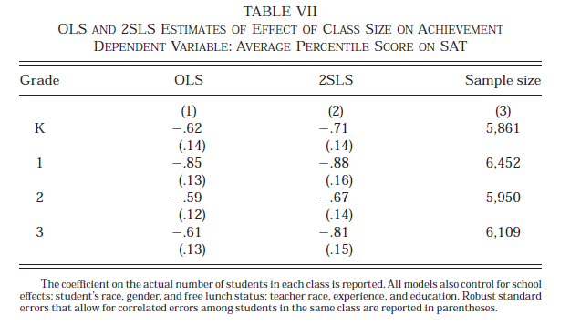
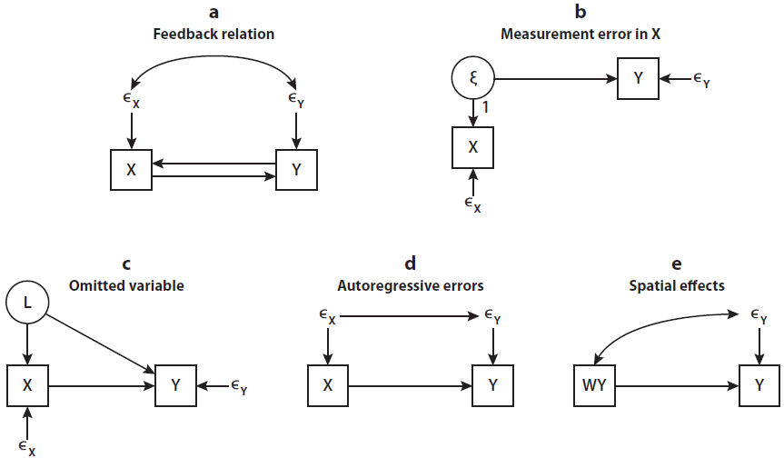
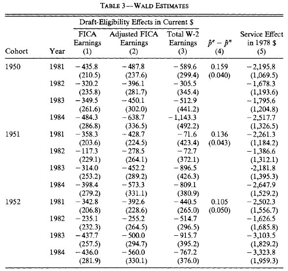
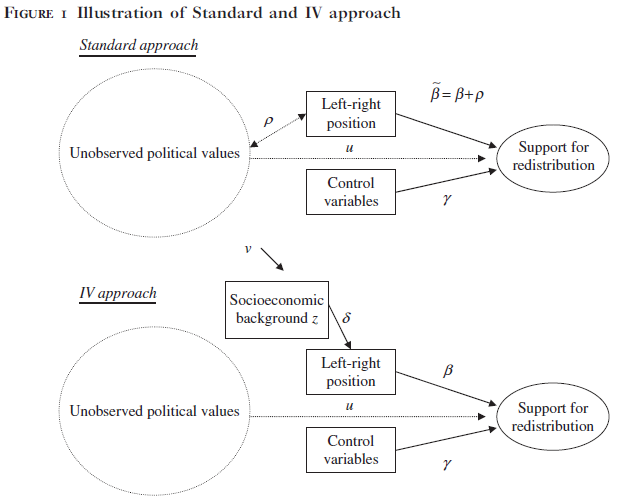
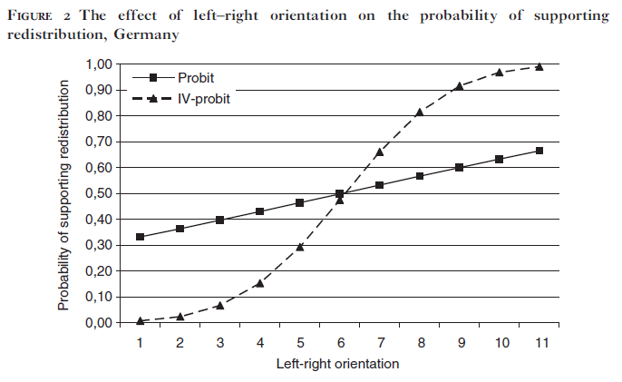
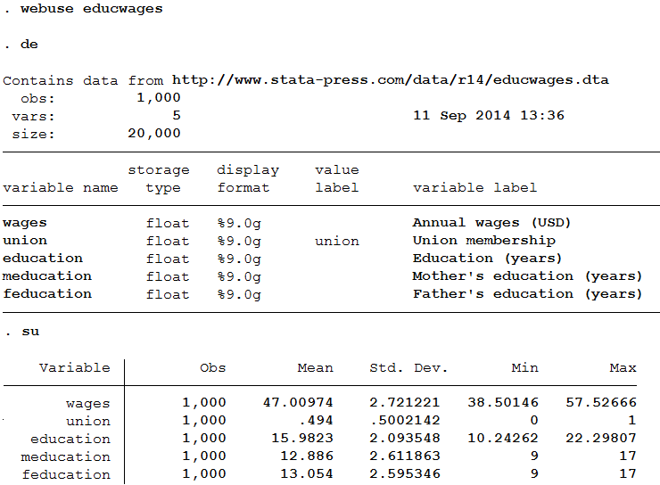
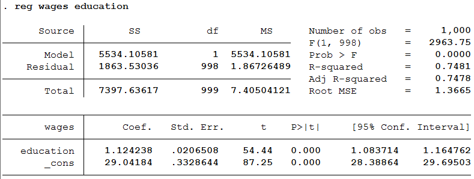
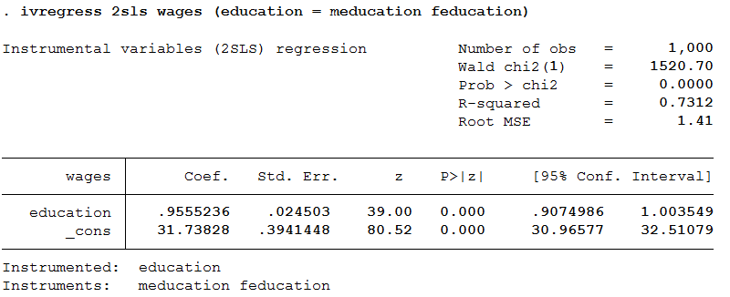
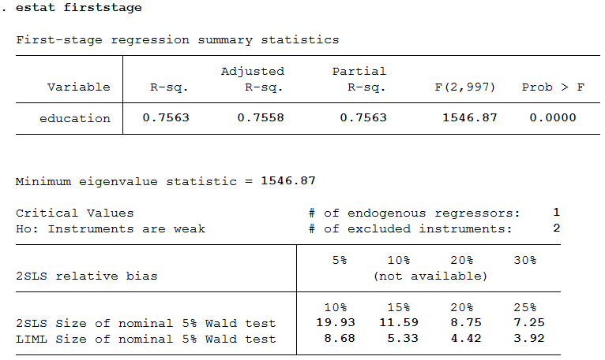

### Instrumental Variable Regression

#### Advanced applied statistics, 2015

##### Erik Gahner Larsen

---

## Agenda

- Instrumental variable (IV) regression

- IV and LATE

- IV and regressions

- IV in STATA and R

---

## IV between design and statistics

- "Instrumental-variable analysis can therefore be positioned between the poles of design-based and model-based inference, depending on the application." (Dunning [2012](http://www.cambridge.org/us/academic/subjects/politics-international-relations/research-methods-politics/natural-experiments-social-sciences-design-based-approach), 153)

- It's still about design-based causal inference
  - Design $>$ statistics

---

### What is an instrumental variable (IV)?

"An instrument is a variable thought to randomly induce variation in the treatment variable of interest." (Gelman and Hill [2007](http://www.cambridge.org/us/academic/subjects/statistics-probability/statistical-theory-and-methods/data-analysis-using-regression-and-multilevelhierarchical-models), 216)

- First, think of assignment to treatment ($W_{i}$) as the instrument

- We want causal estimands in settings with noncompliance

- Task: To estimate the treatment effect for units who always comply with their assignment.

---

#### Example: Noncompliance with Encouragement $W_{i}$ to Exercise $D_{i}$

- From Table 5.5 in Rosenbaum ([2002](http://www.springer.com/us/book/9780387989679), 182).

- Y: forced expiratory volume (higher numbers signifying better lung function)

- Will subject exercice with encouragement? ($d_{i}(1)$)
- Will subject exercice without encouragement? ($d_{i}(0)$)

---

#### Example: Noncompliance with Encouragement $W_{i}$ to Exercise $D_{i}$

| User _i_ &nbsp;&nbsp;&nbsp; | $d_{i}(1)$ &nbsp;&nbsp;&nbsp; | $d_{i}(0)$ &nbsp;&nbsp;&nbsp; | $Y_{i}(1)$ &nbsp;&nbsp;&nbsp; | $Y_{i}(0)$ &nbsp;&nbsp;&nbsp; | $W_{i}$ &nbsp;&nbsp;&nbsp; | $D_{i}$ &nbsp;&nbsp;&nbsp; |  $R_{i}$ |
|-------------|:---:|:---:|:---:|:---:|:---:|:---:|:---:|
| 1 | 1 | 1 | 71  | 71 | 1 | 1 | 71 |
| 2 | 1 | 1 | 68  | 68 | 0 | 1 | 68 |
| 3 | 1 | 0 | 64  | 59 | 1 | 1 | 64 |
| 4 | 1 | 0 | 62  | 57 | 0 | 0 | 57 |
| 5 | 1 | 0 | 59  | 54 | 0 | 0 | 54 |
| 6 | 1 | 0 | 57  | 52 | 1 | 1 | 57 |
| 7 | 1 | 0 | 56  | 51 | 1 | 1 | 56 |
| 8 | 1 | 0 | 56  | 51 | 0| 0 | 51 |
| 9 | 0 | 0 | 42  | 42 | 0 | 0 | 42 |
| 10 | 0 | 0 | 39 | 39 | 1 | 0 | 39 |


---

### Assignment to treatment, instrument

- We use IV to estimate the effect of treatment on compliers

- Instrument: $W_{i}$ (assignment to treatment)

- Treatment status: $D_{i}(W) \in \{0,1\}$

- Imperfect compliance, so $W_{i} \neq$ $D_{i}$ for some units

- The outcome, $Y_{i}$, is a function of W and D: $Y_{i}(W,D)$

---

### Assignment to treatment, instrument

- The causal effect of W on Y (ITT): $Y_{i}(1,D_{i}(1)) - Y_{i}(0,D_{i}(0))$

- What is the issue with ITT (the reduced-form result)? Non-compliance

- Task: We want to estimate the causal effect for those who comply
  - The effect of D on Y for units affected in treatment status by instrument
  - Local average treatment effect (LATE)
  - "Local average treatment effects can be estimated by comparing the average outcome Y and treatment D at two different values of the instrument" (Imbens and Angrist [1994](http://www.jstor.org/stable/2951620), 470)

---

### Assignment to treatment, instrument

- Assumptions: _Independence_, _first stage_, _monotonicity_

- Independence: $(Y(1),Y(0),D(1),D(0)) \perp W$
  - We can identify the causal effect of the instrument
  - Potential outcomes implies exclusion restriction (_exogenous_): 
    - Assignment (W) has no direct effect on outcome (Y)

- First stage (_relevance_): $0 < Pr(W = 1) < 1$ and $Pr(D_{i} = 1) \neq Pr(D_{0} = 1)$
  - $W$ has an effect on $D$
  - $E[D_{i}|W_{i} = 1] - E[D_{i}|W_{i} = 0] \neq 0$

- Monotonicity (_no defiers_)

---

### Assignment to treatment, instrument

- The average effect of W on D is Pr(complier). Why?
  - For compliers: $D_{i}(1) - D_{i}(0) = 1$
  - For non-compliers (assuming no defiers): $D_{i}(1) - D_{i}(0) = 0$

- The causal interpretation of the IV estimand (Angrist et al. [1996](http://www.tandfonline.com/doi/abs/10.1080/01621459.1996.10476902), 448): 

$\tau_{LATE} = E(Y_{i}(1)-Y_{i}(0)|complier)$

- LATE: The average causal effect of $D$ on $Y$ for compliers, i.e. units affected in treatment status by instrument

---

### Local average treatment effect

- Should we care about LATE? Depends upon the instrument
  - Different instruments, different effect parameters

- What about always-takers and never-takers?
  - We only capture effects for those who change treatment status due to treatment assignment
  - For always-takers and never-takers, treatment status is unchanged

- Always think about IVs as LATE

- Estimate both ITT and LATE to maximize what we can learn about the intervention (Gelman and Hill [2007](http://www.cambridge.org/us/academic/subjects/statistics-probability/statistical-theory-and-methods/data-analysis-using-regression-and-multilevelhierarchical-models), 220)

---

### Example: Class size and achievement test scores

- Random assignment to smaller or larger class

- Krueger ([1999](http://qje.oxfordjournals.org/content/114/2/497.abstract)): "initial random assignment is used as an instrumental variable for actual class size." (p. 507)

- "It is possible that some students were switched from their randomly assigned class to another class before school started or early in the fall." (p. 502)

---

### Example: Class size and achievement test scores



---

### Example: Class size and achievement test scores


---

# 2SLS?

---

### Instrumental variables and regressions

- A simpe structural model

- First stage: $D_{i} = \alpha_{0} + \alpha_{1}W_{i}+\upsilon_{i}$

- Second stage: $Y_{i} = \beta_{0} + \beta_{1}D_{i}+\epsilon_{i}$

- What is the causal effect of $D$ on $Y$? $\beta_{1}$

- Two-stage least squares (2SLS/TSLS), method to calculate IV estimates

- Get fitted values from stage 1, regress outcome on fitted values (stage 2)
  - However, we need to account for the uncertainty in both stages of the model (Gelman and Hill [2007](http://www.cambridge.org/us/academic/subjects/statistics-probability/statistical-theory-and-methods/data-analysis-using-regression-and-multilevelhierarchical-models), 223)

---

### Confounding in experiments and observational studies

- Confounding in experiments
  - How? Subjects can accept or decline treatment assignment

- Confounding in observational studies
  - How? Good old endogeneity

---

### How do we think about IVs?

- "The solution offered by the instrumental-variables design is to find an additional variable - an instrument - that is correlated with the independent variable but could not be influenced by the dependent variable or correlated with its other causes." (Dunning [2012](http://www.cambridge.org/us/academic/subjects/politics-international-relations/research-methods-politics/natural-experiments-social-sciences-design-based-approach), 87)

---

### How do we think about IVs?

- "Undoubtedly, however, the most important contemporary use of IV methods is to solve the problem of omitted variables bias (OVB). IV methods solve the problem of missing or unknown control variables, much as a randomized trial obviates extensive controls in a regression." (Angrist and Pischke [2009](http://press.princeton.edu/titles/8769.html), 115)

- Most of the time, we use IV regression to study causal inference in non-experimental settings

---

### Error-covariate correlation

- "IV regression in effect replaces the problematic independent variable with a proxy variable that is uncontaminated by error or unobserved factors that affect the outcome." (Sovey and Green [2011](http://onlinelibrary.wiley.com/doi/10.1111/j.1540-5907.2010.00477.x/abstract), 188)

- So there is an endogenous relation between our "problematic independent variable" and our outcome

- Why do we have error-covariate correlations?

---

### Possible causes of error-covariate correlation (Bollen [2012](http://www.annualreviews.org/doi/abs/10.1146/annurev-soc-081309-150141), 40)



---

### What can we use as an IV?

- The sky is the limit

- Lottery numbers (military service, money), birth month, class size, geographical distance etc.

- Remember last week? (fuzzy RDD)

---

### Example: Name americanization and earnings

- Biavaschi et al. ([2013](http://ftp.iza.org/dp7725.pdf)): Scrabble points as an instrumental variable

- "Index based on Scrabble points, which captures the degree of linguistic complexity of names upon arrival compared to the linguistic complexity of names at destination." (p. 2)

- In other words: You will see a lot of creative IVs out there

---


### Example: Effect of military service on earnings

- Angrist ([1990](http://www.jstor.org/stable/2006669)): The Vietnam Draft Lottery

- Outcome (Y): Lifetime earnings

- Treatment status (D): Veteran

- Mean difference between veterans and non-veterans. Why not?

- "The draft lottery facilitates estimation of (1) because functions of randomly assigned lottery numbers provide instrumental variables that are correlated with $s_{i}$, but orthogonal to the error term, $u_{ir}$." (p. 319)

- Draft eligibility is random. We are all about randomization.

---



---

### Example: Policing and crime

- Levitt ([1997](http://www.jstor.org/stable/2951346)): The effect of increased police force on crime

- Why not study the correlation between police force and crime?

- "Cities with high crime rates, therefore, may tend to have large police forces, even if police reduce crime." (p. 270)

- Instrument: Elections

- "In order to identify the effect of police on crime, a variable is required that affects the size of the police force, but does not belong directly in the crime "production function." The instrument employed in this paper is the timing of mayoral and gubernatorial elections." (p. 271)

---


---


---

### Example: The causal effect of left-right orientation on support for redistribution

- Jaeger ([2008](http://ijpor.oxfordjournals.org/content/20/3/363.short)): Is there a causal effect of left-right orientation on support for redistribution? 

- Issue: "left-right orientation is likely to be endogenous to welfare state support" (p. 364)

- IVs: father and mother's educational attainment, father's social class

---

### Example: The causal effect of left-right orientation on support for redistribution



---

### Example: The causal effect of left-right orientation on support for redistribution



---

### Diagnostic tests: How strong is the instrument?

- If Cov(D,W) is weak, we have little compliance. Problem?

- Report the F-test of the instrument from the first stage

- $H_{0}$: Instrument is weak

- Large p-value $\rightarrow$ weak instrument

---

### Diagnostic tests: Endogeneity

- Wu-Hausman test: Test difference in estimates from OLS and IV

- Significant difference $\rightarrow$ $D$ is an endogenous variable

- $H_{0}$: Variable is exogenous

- Large p-value $\rightarrow$ $D$ is exogenous

---

### Diagnostic tests: Overidentifying restrictions

- With multiple IVs (e.g. $W_{1i}$ and $W_{2i}$) we can test if one of the instruments are correlated with the structural error

- In other words: **Not** the unobserved error

- Estimate IV using $W_{1i}$ and compute residuals and test whether $W_{2i}$ correlate with residuals

- If they correlate, $W_{2i}$ is not a valid instrument

- The Sargan test

- $H_{0}$: Instrument set is valid, model is correctly specified

- Large p-value $\rightarrow$ Instrument is valid

---

### IV in Stata

- See YouTube: [Instrumental-variables regression using Stata](https://www.youtube.com/watch?v=lbnswRJ1qV0)

- Dependent variable: `wages`

- Endogenous variable: `education`

- Instrumental variables: `meducation`, `feducation`

- We are going to use the `ivregress` command

---

### IV in Stata: simulated data



--- 

### IV in Stata: results, OLS



--- 

### IV in Stata: results, 2SLS



--- 

### IV in Stata: is education endogenous?


--- 

### IV in Stata: is our IV strong?



--- 

### IV in Stata: are some of our IVs not exogenous?


--- 

### IV in R

- Multiple packages available

- We will run IV regressions in two packages
  - `tsls()` in the `sem` package
  - `ivreg()` in the `AER` package

- Both packages have multiple options

---

### IV in R: load the packages


```r
library(rio) # for import()
library(sem) # for tsls()
library(AER) # for ivreg()
```

---

### IV in R: get the data


```r
educwages <- import("http://www.stata-press.com/data/r14/educwages.dta")
educwages[] <- lapply(educwages, unclass)
head(educwages)
```

```
##      wages union education meducation feducation
## 1 43.77223     0  15.25729         13         13
## 2 46.30014     1  14.48497         11         12
## 3 47.80507     0  17.89353         11         16
## 4 46.30925     1  13.44451         11         12
## 5 45.79170     1  14.20151         15          9
## 6 47.99726     0  18.92245         16         17
```

---

### IV in R: run the IV regressions


```r
reg.tsls <- tsls(wages ~ education, ~ meducation + feducation, data = educwages)
reg.ivreg <- ivreg(wages ~ education | meducation + feducation, data = educwages)
```

---

### IV in R: summary, tsls()


```r
summary(reg.tsls)
```

```
## 
##  2SLS Estimates
## 
## Model Formula: wages ~ education
## <environment: 0x00000000070ab620>
## 
## Instruments: ~meducation + feducation
## <environment: 0x00000000070ab620>
## 
## Residuals:
##     Min.  1st Qu.   Median     Mean  3rd Qu.     Max. 
## -3.95600 -1.03700  0.02553  0.00000  1.01700  4.48200 
## 
##                Estimate  Std. Error  t value   Pr(>|t|)    
## (Intercept) 31.73827721  0.39453950 80.44385 < 2.22e-16 ***
## education    0.95552363  0.02452756 38.95715 < 2.22e-16 ***
## ---
## Signif. codes:  0 '***' 0.001 '**' 0.01 '*' 0.05 '.' 0.1 ' ' 1
## 
## Residual standard error: 1.4114347 on 998 degrees of freedom
```

---

### IV in R: summary, ivreg()


```r
summary(reg.ivreg)
```

```
## 
## Call:
## ivreg(formula = wages ~ education | meducation + feducation, 
##     data = educwages)
## 
## Residuals:
##      Min       1Q   Median       3Q      Max 
## -3.95639 -1.03668  0.02553  1.01666  4.48205 
## 
## Coefficients:
##             Estimate Std. Error t value Pr(>|t|)    
## (Intercept) 31.73828    0.39454   80.44   <2e-16 ***
## education    0.95552    0.02453   38.96   <2e-16 ***
## ---
## Signif. codes:  0 '***' 0.001 '**' 0.01 '*' 0.05 '.' 0.1 ' ' 1
## 
## Residual standard error: 1.411 on 998 degrees of freedom
## Multiple R-Squared: 0.7312,	Adjusted R-squared: 0.731 
## Wald test:  1518 on 1 and 998 DF,  p-value: < 2.2e-16
```

---

### IV in R: summary, ivreg()


```r
summary(reg.ivreg, diagnostics=T)
```

```
## 
## Call:
## ivreg(formula = wages ~ education | meducation + feducation, 
##     data = educwages)
## 
## Residuals:
##      Min       1Q   Median       3Q      Max 
## -3.95639 -1.03668  0.02553  1.01666  4.48205 
## 
## Coefficients:
##             Estimate Std. Error t value Pr(>|t|)    
## (Intercept) 31.73828    0.39454   80.44   <2e-16 ***
## education    0.95552    0.02453   38.96   <2e-16 ***
## 
## Diagnostic tests:
##                  df1 df2 statistic p-value    
## Weak instruments   2 997    1546.9  <2e-16 ***
## Wu-Hausman         1 997     261.1  <2e-16 ***
## Sargan             1  NA       0.0   0.997    
## ---
## Signif. codes:  0 '***' 0.001 '**' 0.01 '*' 0.05 '.' 0.1 ' ' 1
## 
## Residual standard error: 1.411 on 998 degrees of freedom
## Multiple R-Squared: 0.7312,	Adjusted R-squared: 0.731 
## Wald test:  1518 on 1 and 998 DF,  p-value: < 2.2e-16
```

---

### What is a good instrument?

- No statistical test will provide evidence on whether your instrument is working
  - Importance of theory, knowledge of assignment mechanism

- The best instrument is a truly randomized instrument

- "The most important potential problem is a bad instrument, that is, an instrument that is correlated with the omitted variables (or the error term in the structural equation of interest in the case of simultaneous equations)." (Angrist and Krueger [2001](https://www.aeaweb.org/articles.php?doi=10.1257/jep.15.4.69), 79)

- A weak instrument is ... a weak instrument

---

### Checklist (Sovey and Green [2011](http://onlinelibrary.wiley.com/doi/10.1111/j.1540-5907.2010.00477.x/abstract), 198)

- Model
- Independence
- Exclusion Restriction
- Instrument Strength
- Monotonicity
- SUTVA

---

### Model
- Issue to address
  - What is the estimand?
  - Are the causal effects assumed to be homogenous or heterogeneous?

- Relevant evidence and argumentation 
  - Discuss whether other studies using different instruments or populations generate different results.

---

### Independence

- Issue to address
  - Explain why it is plausible to believe that the instrumental variable is unrelated to unmeasured causes of the dependent variable.

- Relevant evidence and argumentation 
  - Conduct a randomization check (e.g., an F-test) to look for unexpected correlations between the instrumental variables and other predetermined covariates.
  - Look for evidence of differential attrition across treatment and control groups.

---

### Exclusion Restriction

- Issue to address
  - Explain why it is plausible to believe the instrumental variable has no direct effect on the outcome.

- Relevant evidence and argumentation 
  - Inspect the design and consider backdoor paths from the instrumental variable to the dependent variable.

---

### Instrument Strength

- Issue to address
  - How strongly does the instrument predict the endogenous independent variable after controlling for covariates?

- Relevant evidence and argumentation 
  - Check whether the F-test of the excluded instrumental variable is greater than 10.
  - If not, check whethermaximum likelihood estimation generates similar estimates.

---

### Monotonicity

- Issue to address
  - Explain why it is plausible to believe there are no Defiers, that is, people who take the treatment if and only if they are assigned to the control group.

- Relevant evidence and argumentation 
  - Provide a theoretical justification or explain why the research design rules out Defiers (e.g., the treatment is not available to those in the control group).

---

### SUTVA

- Issue to address
  - Explain why it is plausible to assume that a given observation is unaffected by
treatments assigned or received by other units.

- Relevant evidence and argumentation 
  - Assess whether there is evidence that treatment effects are transmitted by geographical proximity or proximity within social networks.

---

### Conclusion

- The use of IV requires strong assumptions

- For experiments
  - Less bad data
  - Estimate treatment effect among compliers

- For natural experiments/observational studies
  - Less good data
  - Hard to find strong (and good) instrumental variables

---

### Schedule

- Next week: Factor analysis 
  - With Robert

- Feedback on MA4: December 7 (Monday)
  - Available at my office (**after** 2pm)
  - Resubmission by December 10 (Wednesday!)
    
